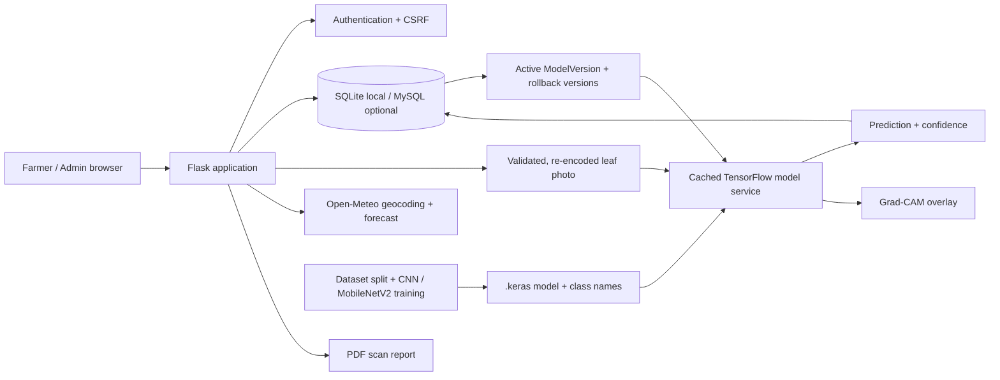
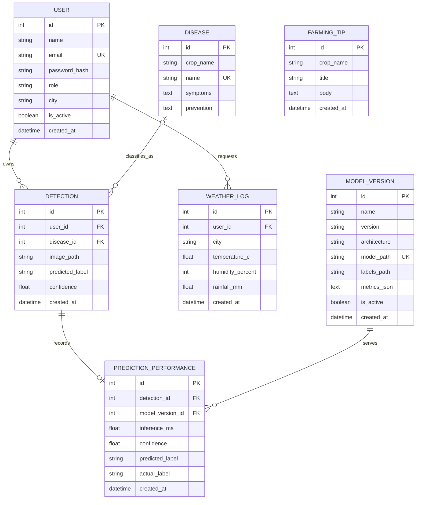

# System Architecture



## Main data relationships

- One `User` owns many `Detection` rows and `WeatherLog` rows.
- One `Disease` catalog entry can be linked to many detections.
- Each `PredictionPerformance` row records the model version, inference time, confidence, and predicted label for one detection.
- A `ModelVersion` can be used by many prediction-performance records; exactly one registered version is selected when a model is activated.
- `FarmingTip` is a managed reference item and is not tied to one user.
- Uploaded images are stored as normalized JPEGs under `app/static/uploads/`; database rows store only the generated filename.

## Entity relationship diagram



## Leaf scan sequence

```mermaid
sequenceDiagram
  actor Farmer
  participant Browser
  participant Flask
  participant Model as TensorFlow model
  participant DB as SQL database
  Farmer->>Browser: Choose JPG or PNG leaf photo
  Browser->>Flask: POST image with authenticated session and CSRF token
  Flask->>Flask: Check extension, file size, image decoding, and pixel limit
  Flask->>Flask: Re-encode as generated JPEG without source metadata
  Flask->>Model: Resize to 224x224 RGB and request class probabilities
  Note over Flask,Model: Selected model contains its own rescaling layer; label JSON order must match output indices
  Model-->>Flask: Class scores
  Flask->>Flask: Generate Grad-CAM from connected spatial feature tensor
  Flask->>DB: Save owner, class, confidence, and generated image path
  DB-->>Flask: Detection record ID
  Flask-->>Browser: Redirect to private result page
  Browser-->>Farmer: Show prediction, confidence, reference, and safety note
```

## Security and operating assumptions

- Passwords use Werkzeug's password hashing. Registration cannot choose an admin role.
- Flask-WTF CSRF protection covers state-changing forms. Admin pages use a role check.
- The default SQLite database is local-demo friendly; set `DATABASE_URL` for MySQL.
- Set `SECRET_KEY` to a long random value outside a local demo. Enable `COOKIE_SECURE=1` only when HTTPS is active.
- Password recovery emails require SMTP configuration. Reset tokens expire after 30 minutes.
- A missing model is an explicit unavailable state. The application never invents a prediction.
- Weather uses Open-Meteo without an API key and needs outbound network access.

## Model selection and evaluation

- At startup, an existing active `ModelVersion` row selects the model and label paths. `MODEL_PATH` and `LABELS_PATH` are fallback configuration when there is no active registered version.
- Model loading is cached by model path. Activation checks 224x224 RGB input, one class-probability vector, ordered labels/output count, and a connected Grad-CAM graph. Each architecture applies its own embedded rescaling: the CNN maps 0-255 to 0-1; MobileNetV2 maps 0-255 to -1-1.
- The MobileNetV2 candidate is registered as the selected local model; the original CNN remains available for rollback through the admin model monitor. Activation requires a complete held-out report and never happens implicitly during registration.
- The saved CNN test report is 83.66% accuracy / 82.11% macro F1. The MobileNetV2 report is 96.20% accuracy / 95.25% macro F1 on the same 1,499-image split. Potato healthy has only 23 test samples. These dataset metrics are not field validation and must not be presented as diagnostic assurance.
- The MobileNetV2 confusion matrix and per-class report live under `models/experiments/mobilenetv2_transfer_v1/test_evaluation/`; the CNN report is under `models/evaluation_best_checkpoint/`. No database schema change is needed for model selection or evaluation metadata.